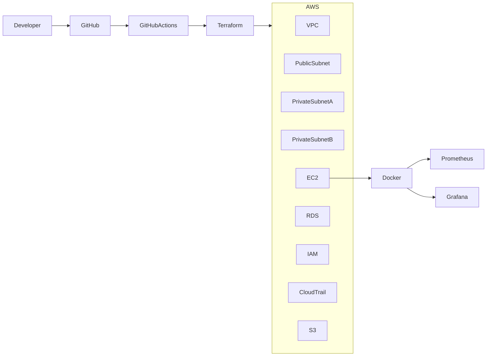

# reto-devops-litethinking
# 🚀 DevOps Technical Challenge – Lite Thinking

<p align="center">


</p>

---

# 📖 Project Overview

This repository contains the solution for the **Platform & DevOps Engineer Technical Challenge**.

The solution automates the provisioning of cloud infrastructure on AWS using Terraform, deploys monitoring services with Docker Compose, enables auditing with CloudTrail, configures IAM roles, and validates the Infrastructure as Code through GitHub Actions.

---

# 🎯 Objectives

- Provision AWS infrastructure using Terraform.
- Deploy monitoring services with Docker.
- Implement security best practices.
- Enable auditing with CloudTrail.
- Automate infrastructure validation using GitHub Actions.
- Demonstrate Infrastructure as Code (IaC) principles.

---

# 🏗 Solution Architecture



---

# ☁ AWS Resources

| Resource | Purpose |
|-----------|----------|
| VPC | Network isolation |
| Public Subnet | EC2 Instance |
| Private Subnets | Amazon RDS |
| Internet Gateway | Internet access |
| Route Table | Network routing |
| Security Groups | Traffic control |
| EC2 Ubuntu | Monitoring server |
| Amazon RDS MySQL | Database |
| IAM Role | Secure EC2 permissions |
| CloudTrail | Audit logging |
| S3 Bucket | CloudTrail logs |

---

# 🐳 Docker Services

The EC2 instance automatically deploys the following containers:

| Container | Port |
|------------|------|
| Prometheus | 9090 |
| Grafana | 3000 |

Docker Compose is executed automatically using Terraform user_data.

---

# 📊 Monitoring

Monitoring stack:

- Prometheus
- Grafana

These services allow infrastructure monitoring and visualization.

---

# 🔐 Security

The project implements:

- IAM Roles
- IAM Instance Profile
- Security Groups
- Private Database Subnets
- SSH Authentication (PEM Key)
- CloudTrail Audit Logging

---

# ⚙ Infrastructure as Code

Terraform modules provision:

- Networking
- Compute
- Database
- IAM
- Logging
- Monitoring

Project structure:

```text
terraform/

├── provider.tf
├── versions.tf
├── variables.tf
├── terraform.tfvars
├── main.tf
├── outputs.tf
├── cloudtrail.tf
└── iam.tf
```

---

# 🔄 Continuous Integration

GitHub Actions automatically executes:

- terraform init
- terraform fmt -check
- terraform validate

> The `terraform plan` stage was intentionally omitted because it requires sensitive variables (RDS password). In production environments these variables should be managed through GitHub Secrets using `TF_VAR_*`.

---

# 🚀 Deployment

Initialize Terraform

```bash
terraform init
```

Validate

```bash
terraform validate
```

Deploy

```bash
terraform apply
```

Destroy Infrastructure

```bash
terraform destroy
```

---

# 📂 Repository Structure

```text
reto-devops/

│
├── .github/
│   └── workflows/
│       └── terraform.yml
│
├── terraform/
│
├── docs/
│
└── README.md
```

---

# 📸 Evidence

The implementation was successfully validated through:

- Terraform Apply
- Terraform Destroy
- AWS EC2
- Amazon RDS
- Docker Containers
- Prometheus
- Grafana
- CloudTrail
- GitHub Actions Pipeline

---

# 📈 Future Improvements

Potential production enhancements:

- Application Load Balancer
- Auto Scaling Group
- Route53
- AWS Certificate Manager
- Amazon ECS / Kubernetes
- Terraform Remote State (S3 + DynamoDB)
- AWS Secrets Manager
- Amazon CloudWatch
- SonarCloud
- Trivy Security Scan

---

# 🛠 Technologies

- Terraform
- AWS
- Docker
- Docker Compose
- Prometheus
- Grafana
- Git
- GitHub
- GitHub Actions
- Linux (Ubuntu)

---

# 👨‍💻 Author

**Jeisson Espitia**

Platform Engineer | DevOps | Cloud | SRE | DevSecOps

Bogotá, Colombia

---

## ⭐ Technical Highlights

✔ Infrastructure as Code

✔ AWS Cloud

✔ Monitoring

✔ Automation

✔ Security

✔ CI/CD

✔ Docker

✔ Terraform

✔ CloudTrail

✔ GitHub Actions
